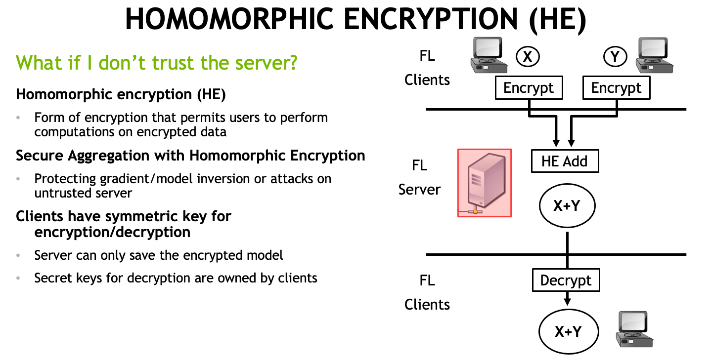

# Homomorphic Encryption Sandbox



## Background

Homomorphic Encryption allows data to be manipulated while it is still encrypted.
This property is useful when sensitive data needs to be processed, analyzed, or transmitted.
This example uses a Paillier Cryptosystem, which is a probabilistic asymmetric algorithm for public key cryptography.

The Paillier Encryption can perform four types of Homomorphic operations:

* Homomorphic Addition: Allows adding two encrypted values to get the * encrypted sum or to add an encrypted value to a constant.
* Homomorphic Subtraction: Allows subtracting two encrypted values to get the encrypted difference or to subtract a constant from an encrypted value.
* Homomorphic Multiplication: Allows us to multiply an encrypted value by a constant to get the encrypted product.
* Homomorphic Division: Allows us to divide an encrypted value by a constant to get the encrypted division.

The Homomorphic Encryption provides a powerful tool for secure computation on sensitive data. Paillier Encryption is just one example of a Homomorphic Encryption scheme, and there are many other schemes that offer different properties and capabilities.

## Description

In the sandbox script file, we first generate a new public/private key pair using the *generate_paillier_keypair* function from the paillier module. Then, we use the public key to encrypt the numbers using the *encrypt* method. To perform the math operations on the encrypted numbers/constants, we can simply use the `+,-,*,/` operators, which overloads the default behavior of the *paillier.EncryptedNumber* class. Finally, we can use the private key to decrypt the results and verify that the operations are correct.

## Installation

```console
pip install phe

OR

pip3 install phe
```

## Usage

```console
python he-sandbox-test.py

OR

python3 he-sandbox-test.py 
```
